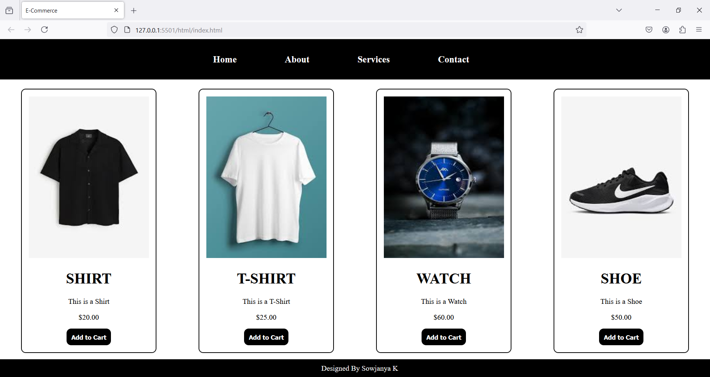

## *Beginner-Friendly Static E-Commerce Site*
+ *This is a simple, static e-commerce website.*
+ *This project provides a straightforward foundation for understanding the basics of web development and creating a simple online store.*

### *Technologies Used :*
+ ***HTML5** : Structured markup.*
+ ***CSS** : Modern styling with Flexbox and Grid.*

### *Getting Started :*
To get started, clone this repository and open index.html in vs code.
+ *In terminal type --> cd E-Commerce*
+ *Right-click anywhere in your HTML file.*
+ *Select Open with Live Server*

### *Output :*

