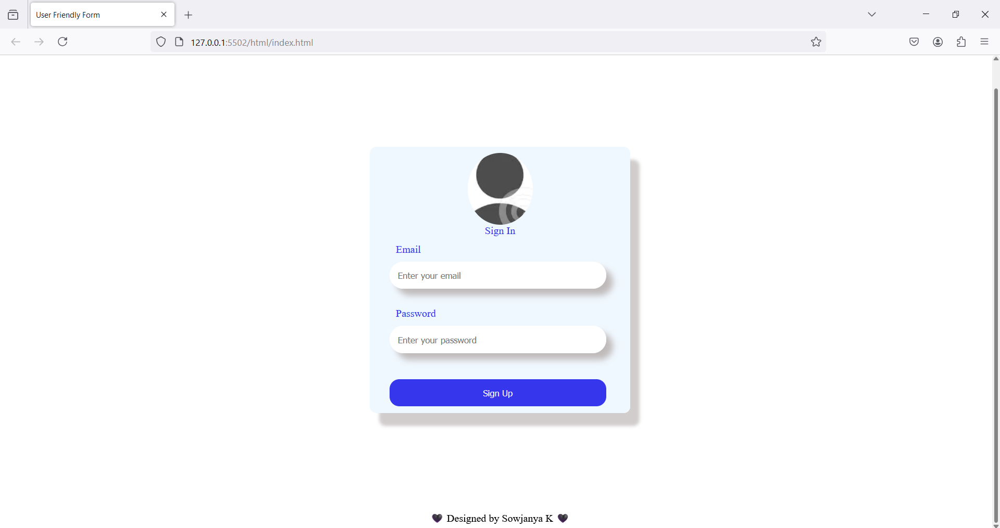

## *Beginner-Friendly Static Form*
+ *This is a simple, static form.*
+ *It is designed to help new developers practice and understand the fundamentals of form creation and styling.* 
+ *The form includes basic input fields and a clean, easy-to-use layout.*

### *Technologies Used :*
+ ***HTML5** : Structured markup.*
+ ***CSS** : Modern styling with Flexbox and Grid.*

### *Getting Started :*
To get started, clone this repository and open index.html in vs code.
+ *In terminal type --> cd Form*
+ *Right-click anywhere in your HTML file.*
+ *Select Open with Live Server*

### *Output :*

  